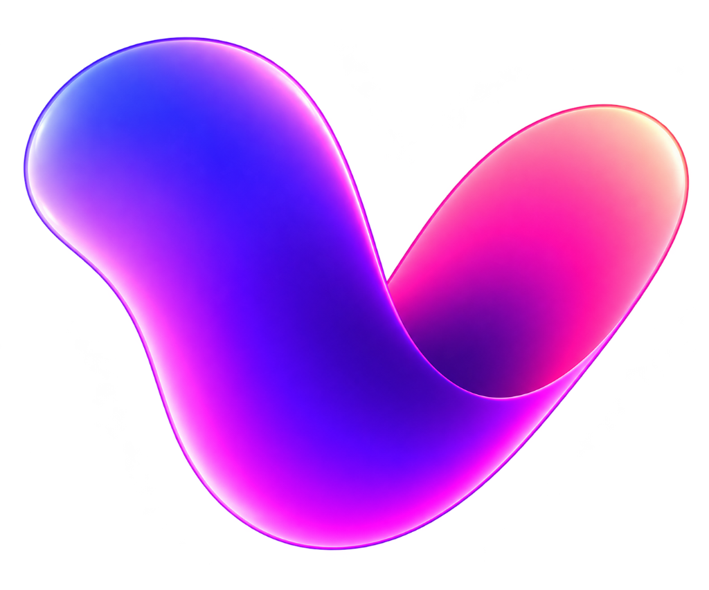

<div align="center">



# Vibey ✨

**Find your vibe.** • **نشوف الـVibe بينكم عامل إزاي؟**  
*Less awkward. More Vibey.*

[](https://vitejs.dev/)
[](https://react.dev/)
[](https://www.typescriptlang.org/)
[](https://tailwindcss.com/)
[](https://www.framer.com/motion/)
[](https://developer.mozilla.org/en-US/docs/Web/API/Web_Audio_API)
[](https://github.com)

</div>

---

## 💡 About Vibey

**Vibey** is a mobile-first, one-phone social conversation game for two people who are together in real life.

> **Core Philosophy:**  
> The phone is **not** the game.  
> The **conversation** between the two people is the game.

Vibey acts as an ambient, intelligent conversation facilitator designed to break the ice, unlock playful banter, and naturally guide two people from casual choices into deep, unforgettable late-night talks.

---

## 🌟 Key Features

### 1. 🎴 Diverse Interactive Card Mechanics
Unlike generic quiz apps, Vibey features 6 distinct interaction models that keep the experience dynamic and spontaneous:
- **⚡ Quick Choice:** Two-player interactive dilemma (e.g. *قهوة ولا آيس كوفي؟*). Both pick on one phone; matches trigger a vibrant chime (*"Same vibe 👀🔥"*), while conflicting choices trigger a playful debate prompt (*"أوكي… كل واحد يبرر بقى 😂"*).
- **📋 Multiple Choice:** Casual 4-option prompts designed for fast travel, lifestyle, and situational debates.
- **💬 Open Conversation:** Zero predefined options. The prompt is the visual hero, allowing players to put down the phone mentally and talk freely.
- **👀 Spontaneous Follow-Ups:** 20–30% of open questions reveal an optional bonus question (*"طب سؤال كمان 👀"*) that takes the discussion a layer deeper.
- **🎯 3D Guess Me Mini-Game:** Player 1 secretly selects an option, the card flips with a 3D perspective animation, and Player 2 guesses. Features reveal glow, correct chime, and gentle shake feedback.
- **🎲 Plot Twists:** Spontaneous social challenges occurring every 6–9 cards (e.g., swapping music history, describing each other in 3 words, eye-contact showdowns, or secret handshakes).

### 2. 📈 Natural Progression Engine
Vibey avoids awkward jumps between casual icebreakers and personal chemistry. The engine orchestrates questions through 5 progressive tiers:
- **Level 1:** Casual preferences & lifestyle habits
- **Level 2:** Everyday quirks, routines & music
- **Level 3:** Stories, childhood memories & opinions
- **Level 4:** Chemistry, attraction, Green Flags & unspoken curiosities
- **Level 5:** Meaningful perspectives, pivots, and 2 AM deep talk

### 3. 🧠 Smart Holistic Result Engine
The final result is calculated from the **entire session**, evaluating choices, liked tags, skips, guess accuracy, and completed plot twists into 6 archetypes:
- **🧠 Same Braincell:** High matching answers and telepathic guess accuracy.
- **🗣️ Certified Yappers:** Endless conversation, high engagement, and zero skips.
- **😌 Chill Chemistry:** Effortless, relaxed, and comfortable connection.
- **🌙 Unexpectedly Deep:** Strong engagement with late-night reflective prompts.
- **⚡ Opposites, Somehow Working:** Contrasting picks that fuel lively banter.
- **🎲 Chaotic Energy:** Spontaneous challenges, playful wit, and wild energy.

Includes a screenshot-ready card generator with **Web Share API** integration and one-click PNG image export.

### 4. 🌐 Bilingual Egyptian Arabic & English
- **Arabic:** Natural, authentic **Egyptian Arabic** using the **Alexandria** font, seamlessly blending everyday slang (*Vibe*, *Chemistry*, *Green Flag*, *Plot Twist*, *Crush*). Full RTL layout.
- **English:** Clean modern geometric phrasing using **Plus Jakarta Sans**. Full LTR layout.
- Instant, zero-reload language switching with local storage persistence.

### 5. 🔊 Pure Web Audio API Synthesis
- **Zero network requests for audio:** All sound effects (*tap, cardSwipe, choiceSelect, match, different, goodQuestion fire, plotTwist impact, guessCorrect, guessWrong, resultReveal*) are synthesized mathematically in real-time.
- 0ms latency, zero missing asset errors, 100% offline.
- Built-in sound toggle with state persistence.

### 6. 📱 Precision Mobile-First UX
- Calibrated for **iPhone 15 / 15 Pro** viewports (`393×852`).
- Dark-first aesthetic: Near-black backgrounds (`#09090b`), deep graphite card surfaces (`#121018`), and ambient violet/magenta frequency glows.
- Full support for `env(safe-area-inset-top)` and `env(safe-area-inset-bottom)`.
- Smooth **Framer Motion** gesture drag with spring physics:
  - Drag right: **التالي (Next)**
  - Drag left: **عدّي (Skip)**
- Lightweight particle burst on **🔥 Good Question**.
- `navigator.vibrate` haptic feedback integration with graceful browser feature detection.

---

## 📚 Content Database (305+ Cards)

Vibey includes **305+ hand-crafted, genuinely unique cards** with full Arabic and English content:

| Category | Count | Levels | Description |
| :--- | :---: | :---: | :--- |
| **⚡ Quick Vibes** | 60 | 1–2 | Rapid dilemmas and choices to break the silence |
| **👀 Get To Know Me** | 60 | 2–3 | Real curiosities, habits, and stories beyond social media bios |
| **🎯 Guess Me** | 40 | 2–4 | Secret choice & guessing mini-game with 3D card flips |
| **🔥 Chemistry** | 60 | 3–4 | Sparks, attraction, Green Flags, and unspoken curiosities |
| **🌙 Deep Talk** | 50 | 4–5 | Late-night frequency: memories, life pivots, and honest perspectives |
| **🎲 Plot Twists** | 35 | 2–4 | Spontaneous real-world mini-challenges for both players |
| **Total** | **305** | **1–5** | **100% bilingual, uniquely tagged & leveled** |

---

## 🛠️ Tech Stack

- **Framework:** [React 19](https://react.dev/) + [Vite 8](https://vitejs.dev/)
- **Language:** [TypeScript 6](https://www.typescriptlang.org/) (Strict mode, `verbatimModuleSyntax`)
- **Styling:** [Tailwind CSS 4](https://tailwindcss.com/) + `@tailwindcss/vite`
- **Typography:** Google Fonts (`Alexandria` for Arabic, `Plus Jakarta Sans` for English)
- **Animation:** [Framer Motion 13](https://www.framer.com/motion/)
- **State Management:** [Zustand 5](https://github.com/pmndrs/zustand)
- **Audio:** Web Audio API (`AudioContext`, custom oscillators & envelopes)
- **Icons:** [Lucide React](https://lucide.dev/)
- **Image Generation:** [html-to-image](https://github.com/bubkoo/html-to-image)
- **Storage:** LocalStorage (`vibey_language`, `vibey_sound`, `vibey_seen_questions`, `vibey_liked_tags`, `vibey_sessions`, `vibey_last_mode`)

---

## 📂 Project Architecture

```
src/
├── app/
├── assets/
├── components/
│   ├── brand/
│   │   ├── Wordmark.tsx            # Custom dual-wave brandmark
│   │   └── VibeyWaves.tsx          # Nightlife ambient glow backdrop
│   ├── cards/
│   │   ├── GuessMeCard.tsx         # 3D flippable card mini-game
│   │   ├── MultipleChoiceCard.tsx  # 4-option chips
│   │   ├── OpenConversationCard.tsx# Open question hero + follow-up expander
│   │   ├── PlotTwistCard.tsx       # Spontaneous challenge card
│   │   ├── QuickChoiceCard.tsx     # Two-player dilemma with match/defend
│   │   └── SwipeableCardContainer.tsx # Drag physics & threshold detection
│   ├── game/
│   │   ├── CardControls.tsx        # Skip, Good Question 🔥, and Next
│   │   ├── GameHeader.tsx          # Exit, mode title, progress bar, audio toggle
│   │   └── GameScreen.tsx          # Active card viewport coordinator
│   ├── home/
│   │   ├── HomeScreen.tsx          # 5 mode cards with ambient expansion
│   │   ├── IntroSplash.tsx         # Staggered entry animation (<1.5s)
│   │   └── SessionSetupModal.tsx   # Length (10/20/35) & Turn modes
│   ├── results/
│   │   ├── ResultCardShare.tsx     # Clean screenshot card
│   │   └── ResultScreen.tsx        # Sequential reveal & sharing actions
│   └── ui/
│       ├── FireParticles.tsx       # 5-particle upward burst
│       ├── LanguageToggle.tsx      # AR / EN switcher
│       └── SoundToggle.tsx         # Audio on/off toggle
├── data/
│   └── questions/
│       ├── chemistry.ts            # 60 Chemistry cards
│       ├── deep-talk.ts            # 50 Deep Talk cards
│       ├── get-to-know-me.ts       # 60 Get To Know Me cards
│       ├── guess-me.ts             # 40 Guess Me cards
│       ├── index.ts                # Database registry & stats
│       ├── plot-twists.ts          # 35 Plot Twist challenges
│       └── quick-vibes.ts          # 60 Quick Vibes cards
├── lib/
│   ├── game-engine.ts              # Progression, deck builder, tag weighting
│   ├── haptics.ts                  # navigator.vibrate wrapper
│   ├── result-engine.ts            # Full-session archetype calculator
│   ├── sound-manager.ts            # Web Audio API synthesizer
│   ├── storage.ts                  # LocalStorage persistence helpers
│   └── translations.ts             # Egyptian Arabic & English dictionaries
├── store/
│   └── game-store.ts               # Zustand store for entire app lifecycle
├── types/
│   └── game.ts                     # TypeScript definitions
├── App.tsx                         # Screen coordinator & direction sync
├── index.css                       # Tailwind layers, typography & glow styles
└── main.tsx                        # React DOM entry point
```

---

## 🚀 Quick Start

### Prerequisites
- [Node.js](https://nodejs.org/) (v18 or newer)
- npm (v9 or newer)

### Installation
```bash
# Clone the repository
git clone https://github.com/your-username/vibey.git
cd vibey

# Install dependencies
npm install
```

### Development Server
```bash
npm run dev
```
Open [http://localhost:5173/](http://localhost:5173/) in your browser. Open Developer Tools and toggle the device toolbar to an iPhone viewport (`393×852`) for the intended mobile experience.

### Production Build
```bash
npm run build
```

### Preview Production Build
```bash
npm run preview
```

### Linting
```bash
npm run lint
```

---

## 🛡️ Privacy & Safety Principles

1. **Zero Spoken Data Storage:** Spoken conversations stay between the two people. Vibey never records audio, requests microphone permissions, or logs user dialogue.
2. **Instant & Shame-Free Skips:** Every single card can be skipped immediately with no penalty, timers, or judgmental copy.
3. **Safe Boundaries:** Questions and plot twists never pressure players into sharing passwords, showing private galleries, making unwanted physical contact, or discussing explicit topics.
4. **No External Tracking:** No Google Analytics, no Firebase, no tracking cookies, and no third-party telemetry.

---

## 📄 License

MIT © [Asem Abdelal](https://github.com/asemabdelal)
